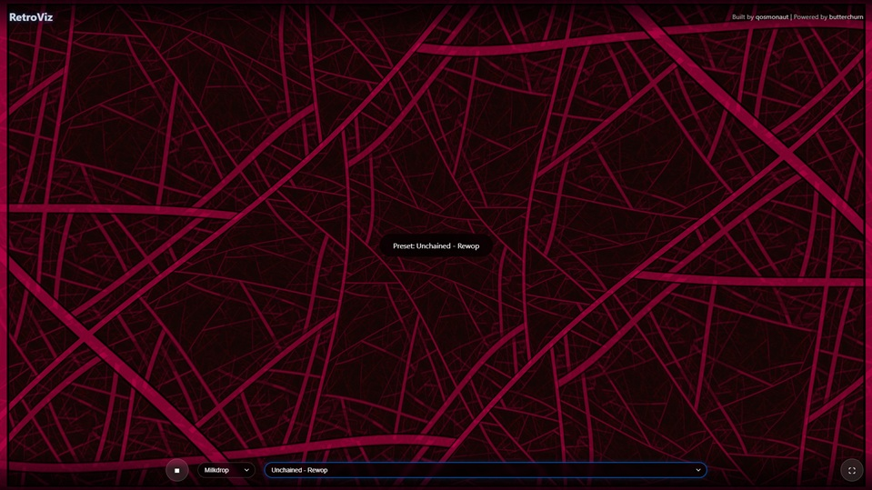

# RetroViz

Old school Winamp music visualizations as a webapp with microphone or file input.



## Features

- **Real-time audio visualization** from your microphone
- **Multiple visualization types:**
  - Milkdrop - Classic Winamp Milkdrop visualizer powered by butterchurn
  - Bars - Classic frequency bars
  - Oscilloscope - Waveform display
  - Spectrum - Frequency spectrum with reflections
  - Circular - Radial frequency display
- **Multiple color schemes:**
  - Classic Blue
  - Fire
  - Ocean
  - Rainbow
  - Neon Green
- **Responsive design** that works on desktop and mobile
- **Pure vanilla JavaScript** - no frameworks required

## Usage

1. Open the webpage in a modern browser
2. Click "Start Microphone" button
3. Grant microphone permissions when prompted
4. Select your preferred visualization type and color scheme
5. Make some noise and watch the visualization respond!

## Local Development

This project uses npm for dependency management and webpack for bundling.

### Setup

```bash
# Install dependencies
npm install

# Run local dev server on `http://localhost:8000` with hot-reload
npm run dev

# Build the project
npm run build

# Deploy to Cloudflare Pages
npm run deploy
```

## Technologies Used

- **Web Audio API** - For audio input and frequency analysis
- **Canvas API** - For rendering visualizations
- **WebGL** - For hardware-accelerated graphics
- **File API** - For loading songs
- **MediaDevices API** - For microphone access
- **Webpack** - Module bundler for JavaScript
- Pure HTML5, CSS3, and JavaScript (ES6+)

## Attribution

This project uses [butterchurn](https://github.com/jberg/butterchurn), a WebGL implementation of the legendary Winamp / Milkdrop visualization engine. Milkdrop was originally created by Ryan Geiss and has been a beloved music visualization tool since the early 2000s. The butterchurn project brings this classic experience to modern web browsers.

- **[Milkdrop](https://www.geisswerks.com/milkdrop/)** - Original visualization engine by @geiss (Ryan Geiss)
- **[butterchurn](https://github.com/jberg/butterchurn)** - WebGL port by @jberg (Jordan Berg)
- **[Heroicons](https://heroicons.com/)** - SVG icons by tailwindcss

## Privacy

All audio processing happens locally in your browser. No audio data is sent to any server.

## License

MIT License – feel free to use and modify as you wish, with or without attribution, but keep the license notice intact.
